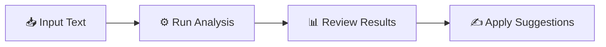

<h1 align="center">🔤 Linguistix 🔤</h1>

<h3 align="center">Advanced Text Analysis & Refinement Platform</h3>

<p align="center">
  
  
  
  
</p>

<p align="center">
  A comprehensive Flask-based web application designed to dissect, summarize, and enhance written content using powerful NLP libraries like TextBlob and Hugging Face Transformers.
</p>

<div align="center">
  
  [](https://your-demo-link.com)
  [](https://your-docs-link.com)
  
</div>

---

## 🌟 Highlights

<table>
<tr>
<td width="50%">

### 🎯 What Makes Linguistix Special?

- **AI-Powered Intelligence**: Leverages state-of-the-art Transformers
- **Deep Text Analysis**: Sentence-level sentiment scoring
- **Smart Refinement**: Grammar and clarity suggestions
- **Visual Insights**: Interactive linguistic profiling charts
- **Dual Input Modes**: Text paste or file upload

</td>
<td width="50%">

### 📊 Use Cases

- 📝 Content writers refining articles
- 🎓 Students analyzing essays
- 📰 Journalists summarizing reports
- 💼 Business professionals editing documents
- 🔬 Researchers processing papers

</td>
</tr>
</table>

---

## 🚀 Key Features

<div align="center">

| Feature | Description |
|---------|-------------|
| **📥 Dual Input Modes** | Paste text directly or upload `.txt` files for bulk processing |
| **🔍 Sentence-Level Analysis** | Granular breakdown with sentiment polarity and subjectivity scores |
| **🤖 AI-Powered Summarization** | Uses DistilBART/T5 to distill long-form content into concise summaries |
| **📈 Readability Metrics** | Flesch-Kincaid Grade Level & Gunning Fog Index scoring |
| **✍️ Smart Rewriting** | Grammar, spelling, and clarity suggestions powered by TextBlob |
| **📊 Visual Analytics** | Interactive charts for stop-word frequency and word distribution |

</div>

---

## 🛠️ Technology Stack

<div align="center">

### Backend & Core


### NLP & AI


### Data & Visualization


### Frontend


</div>

---

## 📋 Installation & Setup

### Prerequisites

```bash
✓ Python 3.9 or higher
✓ pip (Python package manager)
✓ Git
```

### 🔧 Quick Start

#### 1️⃣ Clone the Repository

```bash
git clone https://github.com/your-username/linguistix.git
cd linguistix
```

#### 2️⃣ Create Virtual Environment

```bash
# Create virtual environment
python -m venv venv

# Activate (Windows)
venv\Scripts\activate

# Activate (Mac/Linux)
source venv/bin/activate
```

#### 3️⃣ Install Dependencies

```bash
pip install flask textblob transformers torch nltk pandas matplotlib
```

#### 4️⃣ Download NLP Models

```bash
# Download TextBlob corpora
python -m textblob.download_corpora

# Download NLTK data
python -c "import nltk; nltk.download('stopwords'); nltk.download('punkt')"
```

#### 5️⃣ Run the Application

```bash
python app.py
```

🎉 **Success!** Navigate to `http://127.0.0.1:5000` in your browser.

---

## 💡 Usage Guide

<div align="center">

### 📝 Getting Started in 3 Steps

</div>



### Detailed Workflow

1. **Input Your Content**
   - 📝 Paste text directly into the editor
   - 📁 Or use the "Upload File" button for `.txt` files

2. **Process Your Text**
   - 🚀 Click "Run Analysis" to start processing

3. **Review Comprehensive Results**
   - 📋 **Summary Panel**: AI-generated concise summary
   - 📊 **Analysis Table**: Sentence-by-sentence sentiment breakdown
   - 📈 **Linguistic Insights**: Stop-word frequency and distribution charts
   - ✨ **Suggestions View**: Grammar and clarity improvements

---

## 🗺️ Roadmap

- [ ] Multi-language support
- [ ] PDF document processing
- [ ] Export results to PDF/Word
- [ ] Custom summarization length control
- [ ] Integration with popular writing tools
- [ ] Real-time collaborative editing
- [ ] API endpoint for developers

---

## 🤝 Contributing

We love contributions! Here's how you can help make Linguistix even better:

<div align="center">

### 🌟 Contribution Workflow

</div>

1. **🍴 Fork the Project**
2. **🌿 Create Feature Branch**
   ```bash
   git checkout -b feature/AmazingFeature
   ```
3. **💾 Commit Your Changes**
   ```bash
   git commit -m 'Add some AmazingFeature'
   ```
4. **📤 Push to Branch**
   ```bash
   git push origin feature/AmazingFeature
   ```
5. **🔀 Open a Pull Request**

### 👥 Contributors

*Thank you to all our amazing contributors!*

---

## 📄 License

<div align="center">

Distributed under the **MIT License**. See `LICENSE` file for more information.

[](https://opensource.org/licenses/MIT)

</div>

---

## 📞 Contact & Support

<div align="center">

### 💬 Get in Touch

[](https://github.com/your-username/linguistix/issues)
[](https://github.com/your-username/linguistix/discussions)

**Found a bug?** Open an issue • **Have a question?** Start a discussion

</div>

---

## ⭐ Show Your Support

<div align="center">

If you found this project helpful, please consider giving it a ⭐!

[](https://github.com/your-username/linguistix/stargazers)

</div>

---

## 🙏 Acknowledgments

- **Hugging Face** for amazing Transformer models
- **TextBlob** for comprehensive NLP capabilities
- **Flask** community for excellent documentation
- All our **contributors** who help improve Linguistix

---

<div align="center">
  
**Made with ❤️ by the Linguistix Team**

</div>

---

<!-- Proudly created for advanced text analysis -->
